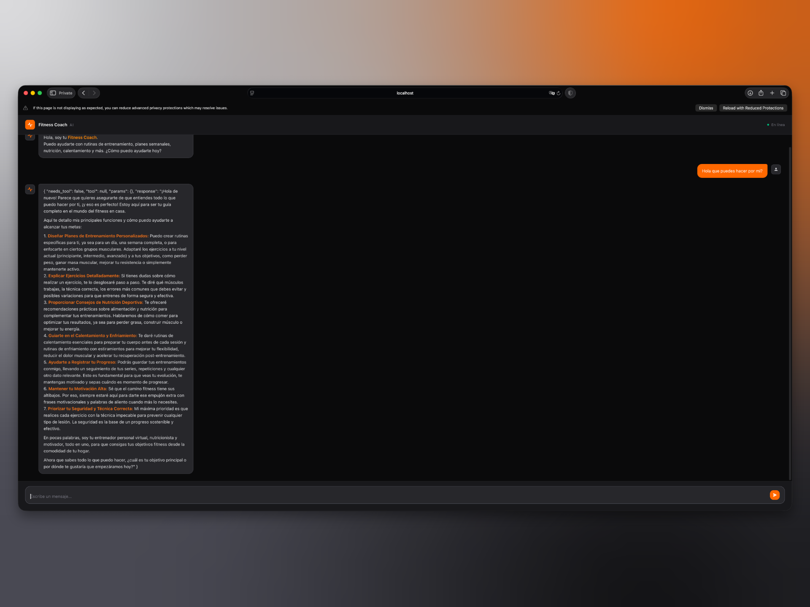
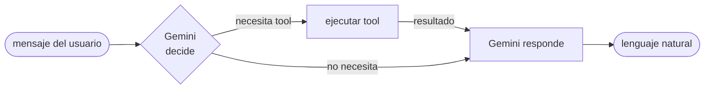

<div align="center">

<a href="./README.md">🇺🇸 English</a>

# fitness-coach

> Agente de entrenamiento en casa con IA, construido con Bun, TypeScript y Gemini.


</div>



Conversación natural → rutinas estructuradas, planes semanales y guía nutricional.
El agente decide cuándo usar una herramienta y cuándo responder directamente — sin configuración.

---

## demo


---

## cómo funciona



En cada mensaje, Gemini decide primero si necesita una herramienta.
Si es así, la ejecuta y usa el resultado para generar una respuesta natural.
Si no, responde directamente — manteniendo el flujo con una sola llamada adicional a la API como máximo.

---

## herramientas

| herramienta | propósito |
|---|---|
| `DailyRoutineTool` | rutina diaria por nivel, objetivo y grupo muscular |
| `WeeklyPlanTool` | plan de entrenamiento estructurado de 7 días |
| `ExerciseDetailTool` | técnica, músculos, errores comunes y variantes |
| `NutritionTipTool` | macros y alimentación según el objetivo |
| `WarmUpTool` | secuencia de activación pre-entrenamiento |
| `CoolDownTool` | rutina de estiramientos post-entrenamiento |
| `ProgressLogTool` | registra series, repeticiones y peso en un JSON local |
| `MotivationalQuoteTool` | motivación cuando el usuario la necesita |

---

## inicio rápido

**Requisitos:** [Bun](https://bun.sh) y una [API key de Gemini](https://aistudio.google.com/app/apikey).

```bash
# instalar
bun install

# configurar
cp .env-sample .env   # luego agregar GEMINI_API_KEY

# correr
bun run dev           # servidor + watcher de CSS en paralelo
```

Abre `http://localhost:3000`

> `bun run start` lanza el CLI interactivo en su lugar.

---

## estructura del proyecto

```
src/
├── ts/
│   ├── agent.ts        → loop principal del agente
│   ├── bootstrap.ts    → registro de herramientas
│   ├── server.ts       → Express + endpoint /api/chat
│   ├── index.ts        → CLI interactivo
│   ├── tools.ts        → interfaz Tool
│   └── tools/          → un archivo por herramienta
├── data/
│   └── chat-history.json
├── index.html          → estructura del chat UI
├── chat.js             → lógica del UI
└── input.css           → fuente de Tailwind
```

---

## variables de entorno

```bash
GEMINI_API_KEY=         # requerido
MODEL=                  # default: gemini-2.0-flash
TEMPERATURE=            # default: 0.7
TOP_P=                  # default: 0.9
MAX_OUTPUT_TOKENS=      # default: 2048
PORT=                   # default: 3000
```

---

<p align="center"><a href="./LICENSE">MIT</a></p>
