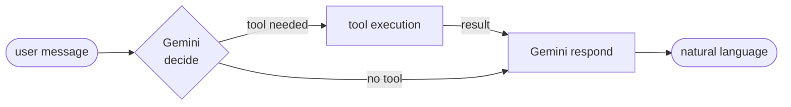

<div align="center">

<a href="./README.es.md">🇪🇸 Español</a>

# fitness-coach

> AI-powered home training agent built with Bun, TypeScript and Gemini.


</div>


Natural conversation → structured workouts, weekly plans and nutrition guidance.
The agent decides when to call a tool and when to respond directly — no configuration required.

---

## demo


---

## how it works



On every message, Gemini first decides whether a tool is needed.
If so, it executes it and uses the result to craft a natural response.
If not, it replies directly — keeping the flow fluid with a single extra API call at most.

---

## tools

| tool | purpose |
|---|---|
| `DailyRoutineTool` | single-day workout by level, goal and muscle group |
| `WeeklyPlanTool` | structured 7-day training plan |
| `ExerciseDetailTool` | form, muscles, common mistakes and variants |
| `NutritionTipTool` | macros and food guidance by goal |
| `WarmUpTool` | pre-workout activation sequence |
| `CoolDownTool` | post-workout stretching routine |
| `ProgressLogTool` | logs sets, reps and weight to a local JSON file |
| `MotivationalQuoteTool` | a push when the user needs it |

---

## getting started

**Prerequisites:** [Bun](https://bun.sh) and a [Gemini API key](https://aistudio.google.com/app/apikey).

```bash
# install
bun install

# configure
cp .env-sample .env   # then set GEMINI_API_KEY

# run
bun run dev           # server + CSS watcher in parallel
```

Open `http://localhost:3000`

> `bun run start` launches the interactive CLI instead.

---

## project structure

```
src/
├── ts/
│   ├── agent.ts        → core agent loop
│   ├── bootstrap.ts    → tool registration
│   ├── server.ts       → Express + /api/chat endpoint
│   ├── index.ts        → interactive CLI
│   ├── tools.ts        → Tool interface
│   └── tools/          → one file per tool
├── data/
│   └── chat-history.json
├── index.html          → chat UI markup
├── chat.js             → UI logic
└── input.css           → Tailwind source
```

---

## environment

```bash
GEMINI_API_KEY=         # required
MODEL=                  # default: gemini-2.0-flash
TEMPERATURE=            # default: 0.7
TOP_P=                  # default: 0.9
MAX_OUTPUT_TOKENS=      # default: 2048
PORT=                   # default: 3000
```

---

<p align="center"><a href="./LICENSE">MIT</a></p>
